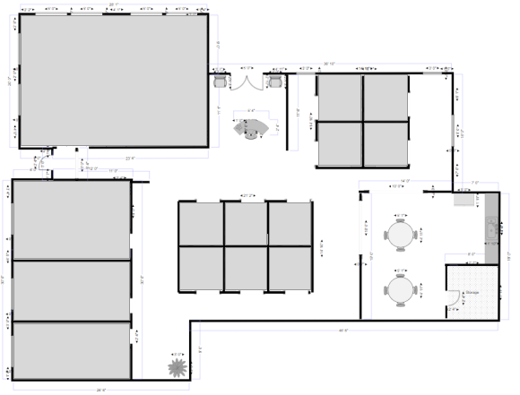

# RFE204 / Booking App

Table of Contents :

1. [Prerequisites](#prerequisites)
1. [Lessons topics](#lessons-topics)  
1. [Assigment](#assigment)
1. [Resources](#resources)

---
## Prerequisites

Measures to take before starting

* Install [VS Code](https://code.visualstudio.com/download) on your local machine
* Setup [Github Desktop](https://desktop.github.com/) on your local machine

---

## Assigment:

Room availability management system should be created.

 

Main page should show floor plan, use uploaded svg file to show it. When cursor is over the room change its color in order to show user which room it is. 

1. Main page should show header with text `Room availability management` and floor plan.
2. Rooms can be selected.
3. Room availability at the moment should be shown over the room with some indicator (text or color)
4. Click the room should redirect to room details page where all the reservations should be shown in table
5. I should be able to add new reservation inside room details page
6. User should not be able to add reservation for busy range of date
7. Create a Mock server to store reservation information (preferably Express app, bit you can use `json-server` as well)

Reservation interface:
```typescript
interface IReservation {
  id: number;
  roomId: number;
  reservedBy: string;
  from: string; // Date
  to: string; // Date
  notes: string;
}
```

Room interface
```typescript
interface IRoom {
  id: number;
  reservations: IReservation[];
}
```

Stack should be used:
1. Material UI or Ant Design (optional)
2. Redux
3. Typescript


